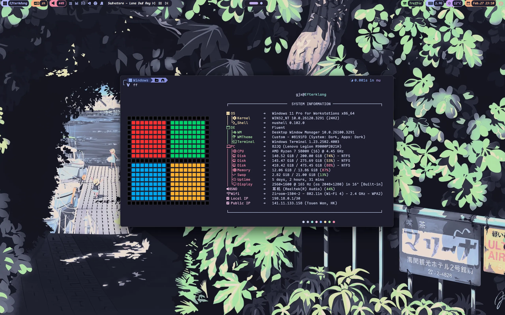
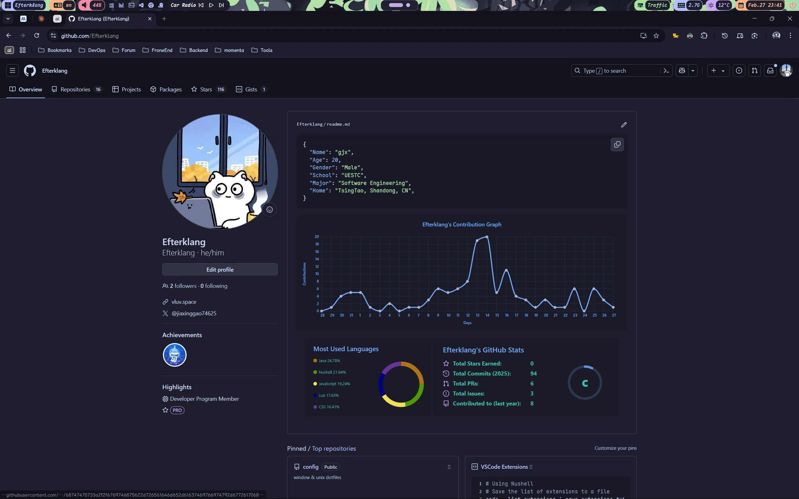
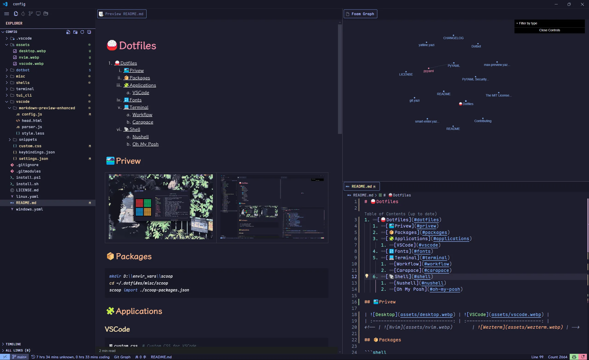
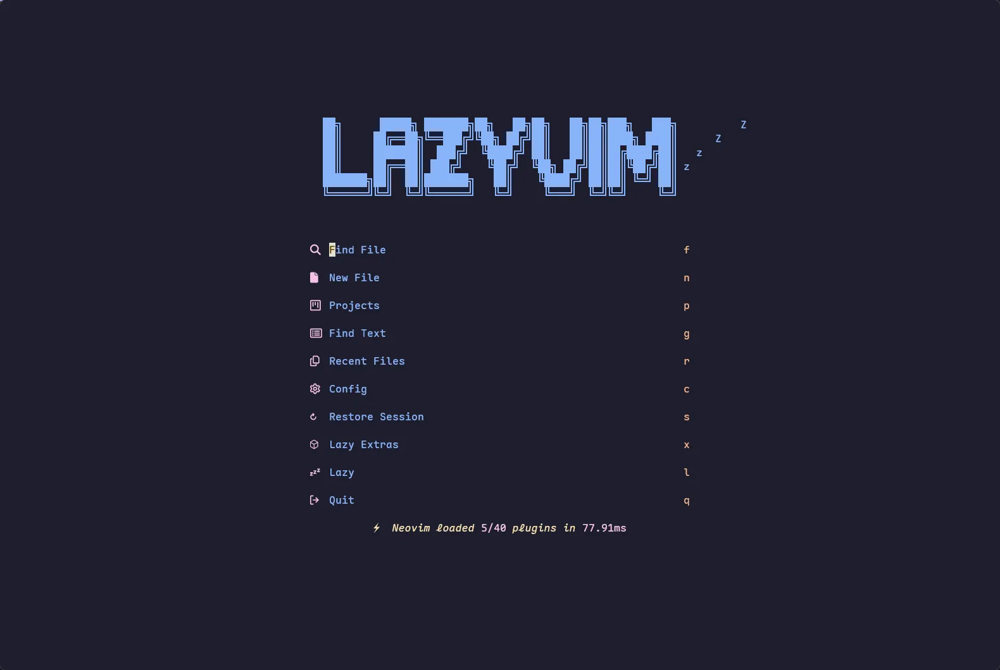
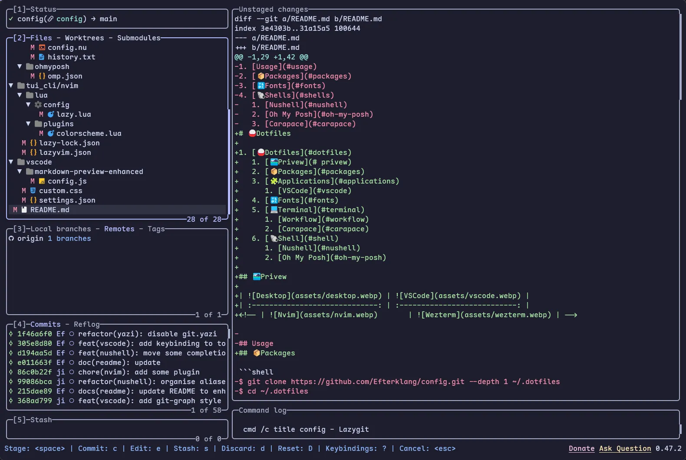
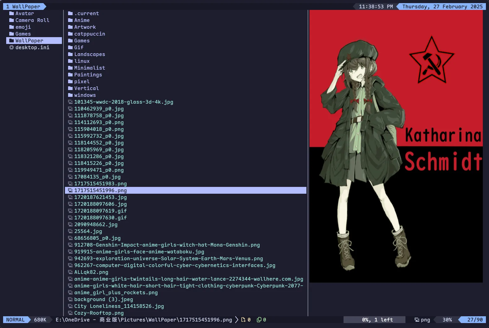

# 🍚Dotfiles

1. [🍚Dotfiles](#dotfiles)
   1. [🏞️Privew](#️privew)
   2. [📦Packages](#packages)
   3. [🧩Applications](#applications)
      1. [VSCode](#vscode)
      2. [Chrome](#chrome)
   4. [🔣Fonts](#fonts)
   5. [💻Terminal](#terminal)
      1. [Workflow](#workflow)
      2. [Carapace](#carapace)
   6. [🐚Shell](#shell)
      1. [Nushell](#nushell)
      2. [Oh My Posh](#oh-my-posh)

## 🏞️Privew

|  |   |
| :-----------------------------: | :---------------------------: |
|    |  |
|  |  |

## 📦Packages

```shell
mkdir D:\\envir_vars\\scoop
cd ~/.dotfiles/misc/scoop
scoop import ./scoop-packages.json
```

## 🧩Applications

### VSCode

```shell
 custom.css  # Custom CSS for VSCode
 keybindings.json  # VSCode Keybindings
 markdown-preview-enhanced  # Markdown Preview Enhanced CSS and JS
 settings.json  # VSCode Global Settings
 snippets  # Code Snippets, including markdown, python, java, etc.
```

### Chrome

- [stylus](https://add0n.com/stylus.html): Stylus - Userstyles Manager
- vimium_c

## 🔣Fonts

- Maple Mono NF CN
- Maple Hand
- Jetbrains Mono
- Monaspace Radon

## 💻Terminal

- Windows Terminal
- Wezterm

### Workflow

- Completion
  - [Carapace](https://carapace.sh/): A multi-shell completion library and binary.
  - [Inshellisense](https://github.com/microsoft/inshellisense): IDE style command line auto complete
- CLI Tools
  - [fd](https://github.com/sharkdp/fd): A simple, fast and user-friendly alternative to 'find'
  - [fzf>=0.59.0](https://github.com/junegunn/fzf): 🌸 A command-line fuzzy finder
  - [bat](https://github.com/sharkdp/bat): A cat(1) clone with wings.
  - [zoxide](https://github.com/ajeetdsouza/zoxide): A smarter cd command. Supports all major shells.
  - [delta](https://dandavison.github.io/delta/installation.html): A syntax-highlighting pager for git, diff, and grep output
  - [tailspin](https://github.com/bensadeh/tailspin): 🌀 A log file highlighter
- TUI Tools
  - [helix](https://github.com/helix-eiditor/helix): A post-modern modal text editor.
  - [lazygit](https://github.com/jesseduffield/lazygit): simple terminal UI for git commands
  - [yazi](https://github.com/sxyazi/yazi): 💥 Blazing fast terminal file manager written in Rust, based on async I/O.

### Carapace

Installation

- Windows: `scoop install extras/carapace-bin`
- Linux:
  - Arch: `yay -S carapace-bin`
  - Others: check [carapace-sh.github.io/carapace-bin/install.html](https://carapace-sh.github.io/carapace-bin/install.html)

## 🐚Shell

- Shell Prompt Theme
  - [oh-my-posh](https://ohmyposh.dev): A prompt theme engine for any shell.
- Shells
  - Nushell
  - Fish
  - Powershell7

### Nushell

Check `./shells/nushell` for more infomation

### Oh My Posh

Installation

- Windows: `winget install JanDeDobbeleer.OhMyPosh -s winget`
- Linux: `curl -s https://ohmyposh.dev/install.sh | bash -s`

Configuration

- Nushell: `oh-my-posh init nu --config ~/.config/ohmyposh/omp.json --print | save ./shells/nushell/plugins/omp.nu --force`
- Fish: `oh-my-posh init fish --config ~/.config/ohmyposh/omp.json | source`
- Bash: `oh-my-posh init fish --config ~/.config/ohmyposh/omp.json | source`
